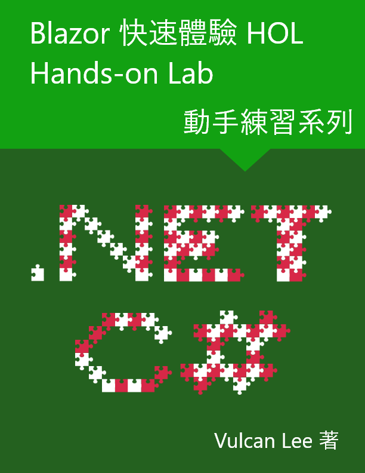

#  Blazor 快速體驗 電子書練習專案原始碼

Blazor 快速體驗電子書，可以從 [https://leanpub.com/Blazor-Quick-Overview](https://leanpub.com/Blazor-Quick-Overview) 取得

# 關於本書

這是一本帶領對於 Blazor 有興趣的新手開發者，可以快速體驗這個微軟最新的網頁開發框架，在這本書中，將不會講解枯澀的相關技術內容，而是設計一個應用情境，也就是一般常用的 CRUD (新增 Create, 查詢 Retrive, 更新 Update, 刪除 Delete) 的應用程式，從無到有的帶領讀者透過 Visual Studio 2019 這個開發工具，設計出的 Blazor 伺服器端的這樣應用程式。

所以，購買本書的讀者，將會強烈建議要跟著本書的內容，逐一進行專案的設計與練習，在每個練習階段，都會有不同要帶給讀者的學習方向，這樣，就會明瞭 Blazor 這個開發框架究竟可以做到什麼樣的強大功能；不過，這本書中並不會詳盡說明各種 Blazor 開發技術內容，而是提供一個動手練習實作的說明步驟，體驗 Blazor 專案開發過程，若您沒有這樣的興趣，請不要購買這本書。

因此，當讀者完成所有的專案練習開發，相信您對於 Blazor 這個優秀的開發框架必定有更清楚的認識，了解到 Blazor 可以做到那些網站設計上的功能。

## 這本書能提供什麼

在這本書裡面，將會提供 8 章的內容，分別是

* 建立 Blazor 伺服器端的專案
  
  了解如何透過 Visual Studio 2019 開發工具，開始建立一個 伺服器端的 Blazor 專案。

* 開始設計CRUD 的新增與刪除功能

  這裡將會透過剛剛建立的 伺服器端 Blazor 專案，設計出一個使用記憶體作為儲存空間的 CRUD 應用程式，不過，在這裡將會先設計出新增與刪除的功能；另外，在這兩章的內容裡，會將 CRUD 的各項程式碼，直接寫 Blazor Component 元件裡。

* 增加 CRUD 的新增與修改對話窗功能

  延續上一章的開發，將會繼續開發新增與修改功能，不過，對於要新增與修改的紀錄，可以透過 BootStrap 的對話窗功能來進行記錄輸入，不過，在這裡將不是透過呼叫 jQuery 的方式，而是透過 C# 資料綁定的處理機制來顯示這個對話窗。

* 建立記事服務並且使用相依性注入服務

  為了要能夠設計出一個容易維護的專案程式碼，因此，在這裡將會設計一個抽象介面與實作該介面的具體服務類別，並且透過 ASP.NET Core 提供的相依性注入服務，將所需要的具體服務類別執行個體，注入到 Blazor Component 元件內，如此，便可以在 Blazor 元件內使用這個具體服務類別物件，來進行 CRUD 的存取。

* 使用資料庫來儲存記事服務相關紀錄

  接下來將會使用 Entity Framework Core 套件，設計一個新的提供資料庫(這裡將會使用 SQLite 資料庫做為操作範例)存取的具體服務類別；一旦完成這個資料庫存取的具體服務類別，只需要在 Startup 類別內，註冊這個新建立的資料庫存取具體服務類別，這樣，在不修改原先 Blazor 元件的程式碼下，便可以直接讓這個 Blazor 專案，變換成為不再使用記憶體作為存取目的媒介，而是使用資料庫作為存取媒介的應用程式了。

* 在 Blazor 專案內呼叫 JavaScript 程式碼

  在這一章中，將會展示如何透過 C# 來呼叫 JavaScript 的設計過程；這裡會先修改原先的 CRUD 元件中使用的對話窗功能，當要進行新增與修改的時候，將會透過 C# 來呼叫 jQuery 程式碼，讓這個對話窗顯示窗來；另外，將會使用已經包裝好的一個 Blazor NuGet 套件，該套件可以透過 C# 程式碼的呼叫，動態的顯示出一個對話窗，這裡將會針對 刪除 按鈕來進行重新設計，當使用點選 刪除 按鈕之後，將會透過 Blazored.Modal 元件來顯示一個對話窗，詢問使用者是否要刪除這筆紀錄，若回答是肯定的，將會立即刪除這筆紀錄。

* 在 Blazor 專案內設計 Web API 服務

  在這之前，已經完成了一個 CRUD 應用程式，並且會將資料記錄存取到資料庫內的功能，現在，將可以在 Blazor 專案內啟用 RESTful API 功能，讓這個網站也可以提供 Web API 的服務；所以，透過這章的開發練習，將會知道如何在 Blazor 專案內來設計出 RESTful Web API 的服務。

* 使用 Web API 來儲存記事服務相關紀錄

  最後，將會需要重新設計一個存取 Web API 的具體服務類別，並且將這個服務註冊到 ASP.NET Core 內的 DI 容器中，並且也無須修改原有 Blazor 專案內的元件設計程式碼，將會讓這個 Blazor 專案，可以透過呼叫 Web API 服務，來進行 CRUD 的應用。

## 誰適合閱讀這本書

對於任何想要學習 Blazor 這個開發技術，可以透過本書的開發練習說明，逐步了解到如何真正的設計出一個 Blazor 實用專案。

讀者必須具備 .NET / C# 的開發經驗、HTML / CSS 的基本認識即可，對於開發工具而言，本書是在 Windows 10 作業系統下，使用任何 Visual Studio 2019 的版本，就可以進行開發。

## 練習專案原始碼

本電子書中的練習專案原始碼，可以從 [https://github.com/vulcanlee/Blazor-Quick-Overview](https://github.com/vulcanlee/Blazor-Quick-Overview) 取得

